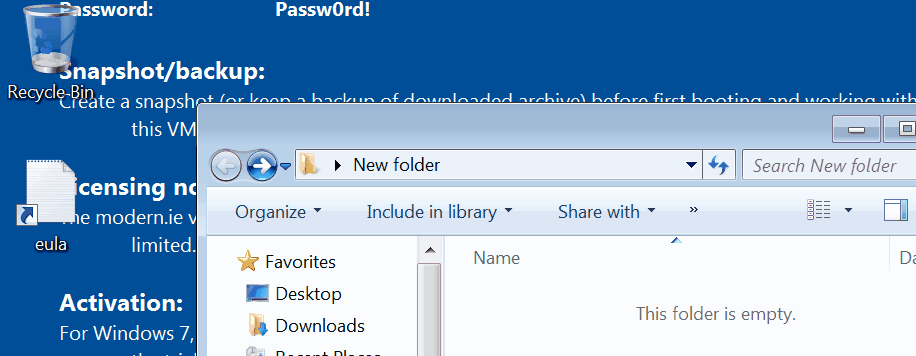

# Make explorer.exe great again
This 'fixes' the annoying issue with `explorer.exe` when opening an exe from the navigation bar:



For more info [read this]()

## THIS PATCHES `ExplorerFrame.dll` - USE AT YOUR OWN RISK
____

Tested on the following:

Version|x64|x86
--|--|--
Win7    |`✔`|`✔`
win8.1  |`✔`|`✔`
Win10   |`✔`|ⁿ/ₐ

ⁿ/ₐ - wasn't tested


# How to install the patch

**To patch 64-bit DLL use a 64-bit installation of python.**

---


Make sure you have `dbghelp.dll` and `symsrv.dll` in the same architecture of the DLL you want to patch.
if you're squeamish about using the ones I provided just copy the ones in your SDK folder(s).

See [dependencies](#Dependencies) for other requirements.


## 1. Making a patched copy

```bat
usage: mega.py [-h] [-i INFILE] [-o OUTFILE] [-d]

optional arguments:
  -h, --help  show this help message and exit
  -i INFILE
  -o OUTFILE
  -d          pass DEBUG option to dbghelp (use dbgview)
```

## 2. Replacing the original
Simply replace the DLL in `system32` folder

or

run **as admin**:
```bat
install.bat [patched-dll]
```

Make sure there aren't any errors.

# Dependencies
- Python 2.7.x
- [Capstone python module for Windows](https://www.capstone-engine.org/download.html)
- pefile


# License
MIT

# Contributing
Feel free to open issues/submit pull requests if you discover a version this doesn't work on. Please provide the respective DLL file.
